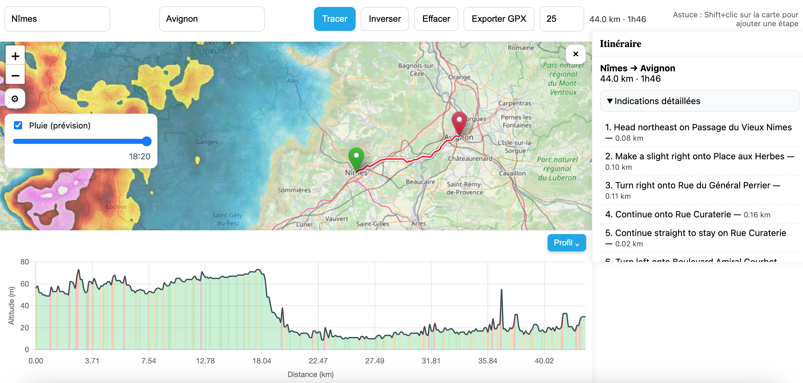

# 🚲 Bike Route Planner Web App



Une application web en **Python + Flask + Leaflet** permettant de tracer un itinéraire vélo, visualiser le profil d'altitude, et exporter au format **GPX**.

---


## ✨ Fonctionnalités actuelles

✅ **Itinéraire vélo** : calculé avec OpenRouteService  
✅ **Points multiples** : départ, arrivée, via-points ajoutables/déplaçables  
✅ **Autocomplétion** : recherche d'adresse avec suggestions en direct  
✅ **Profil d’altitude interactif** avec coloration des pentes selon difficulté  
✅ **Estimation de durée** basée sur la vitesse moyenne définie par l’utilisateur  
✅ **Export GPX** avec altitudes  
✅ **Interface responsive** avec panneaux rétractables :
- **Panneau latéral** : résumé trajet + indications détaillées
- **Panneau bas** : profil d’altitude

---

## 📦 Installation

### 1. Cloner le dépôt
```bash
git clone https://github.com/Fastaxx/Bikeitinerary
cd Bikeitinerary/
````

### 2. Créer et activer un environnement virtuel

```bash
python -m venv .venv
source .venv/bin/activate    # sous Linux/Mac
```

### 3. Installer les dépendances

```bash
pip install -r requirements.txt
```

---

## ▶️ Lancer l’application

```bash
flask run
```

L’application sera disponible sur :
[http://127.0.0.1:5000](http://127.0.0.1:5000)


---

## 🛠 Personnalisation

* **Vitesse moyenne par défaut** : modifiable dans la section "Paramètres avancés" (panneau rétractable en bas).
* **Coloration du profil d’altitude** : seuils de pente ajustables
* **Mode vélo par défaut** : assuré via `profile=cycling` dans les requêtes ORS.

---

## 📌 TODO

* [ ] Ajouter la **superposition météo vent** avec Open-Meteo (flèches statiques sur la carte).
* [x] Ajouter la **superposition météo pluie** avec un sélecteur horaire.
* [ ] Mode "impact du vent" sur durée estimée.
* [ ] Téléchargement GPX optimisé pour GPS Garmin/Wahoo.
* [ ] Import des trajets planifiés.

---

## 📜 Licence

Projet distribué sous licence MIT – utilisation libre avec attribution.

